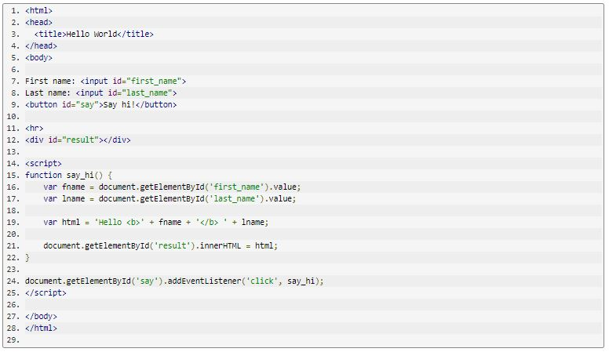

# What is JavaScript ? 
1. It is a lightweight, interpreted, or just-in-time compiled programming language with first-class functions.
2. It is most well-known as the scripting language for Web pages, many non-browser environments also use it, such as Node.js, Apache CouchDB and Adobe Acrobat.
3. It is a prototype-based, multi-paradigm, single-threaded, dynamic language, supporting object-oriented, imperative, and declarative (e.g. functional programming) styles.
# How to create a simple input and output in pure Javascript ?
*By following the steps in this example

## JavaScript Variables:
+ JavaScript variables are containers for storing data values.
+ Before 2015, using the var keyword was the only way to declare a JavaScript variable.
+ In programming, just like in algebra, we use variables to hold values.
+ In programming, just like in algebra, we use variables in expressions