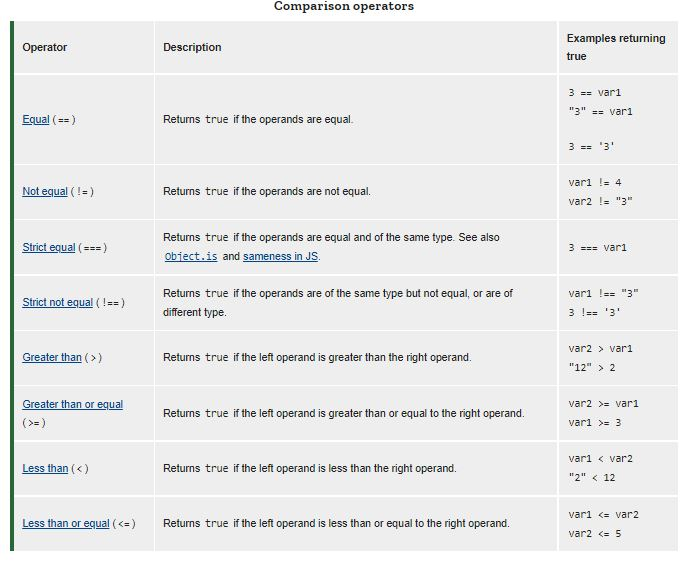
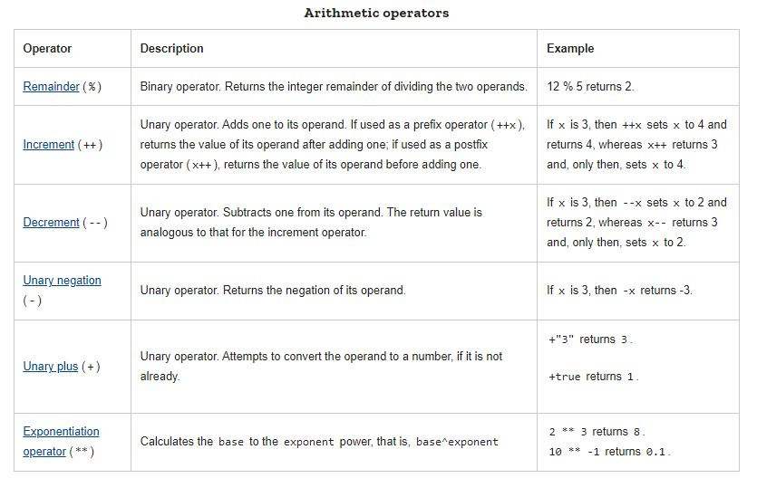
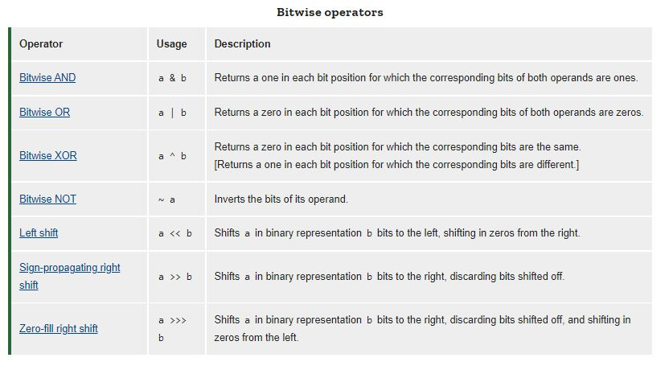

# **Operations in JavaScript is as following:**  
1- **Assignment operators** : An assignment operator assigns a value to its left operand based on the value of its right operand. The simple assignment operator is equal (=), which assigns the value of its right operand to its left operand. That is, x = y assigns the value of y to x.  
*There are also compound assignment operators that are shorthand for the operations listed in the following table:*
  
2- **Comparison operators**: A comparison operator compares its operands and returns a logical value based on whether the comparison is true. The operands can be numerical, string, logical, or object values. Strings are compared based on standard lexicographical ordering, using Unicode values. In most cases, if the two operands are not of the same type, JavaScript attempts to convert them to an appropriate type for the comparison. This behavior generally results in comparing the operands numerically. The sole exceptions to type conversion within comparisons involve the === and !== operators, which perform strict equality and inequality comparisons. These operators do not attempt to convert the operands to compatible types before checking equality.  
*The following table describes the comparison operators in terms of this sample code:*
   
3- **Arithmetic operators**:
An arithmetic operator takes numerical values (either literals or variables) as their operands and returns a single numerical value. The standard arithmetic operators are addition (+), subtraction (-), multiplication (*), and division (/). These operators work as they do in most other programming languages when used with floating point numbers (in particular, note that division by zero produces Infinity).JavaScript provides the arithmetic operators listed in the following table:
   
4- **Bitwise operators**: A bitwise operator treats their operands as a set of 32 bits (zeros and ones), rather than as decimal, hexadecimal, or octal numbers. For example, the decimal number nine has a binary representation of 1001. Bitwise operators perform their operations on such binary representations, but they return standard JavaScript numerical values.

*The following table summarizes JavaScript's bitwise operators.*
  
5- **Logical operators**:
Logical operators are typically used with Boolean (logical) values; when they are, they return a Boolean value. However, the && and || operators actually return the value of one of the specified operands, so if these operators are used with non-Boolean values, they may return a non-Boolean value. The logical operators are described in the following table. 
  
6- **String operators**:
In addition to the comparison operators, which can be used on string values, the concatenation operator (+) concatenates two string values together, returning another string that is the union of the two operand strings.  

7- **Conditional (ternary) operator**:The conditional operator is the only JavaScript operator that takes three operands. The operator can have one of two values based on a condition.    
8- **Comma operator**:The comma operator (,) evaluates both of its operands and returns the value of the last operand. This operator is primarily used inside a for loop, to allow multiple variables to be updated each time through the loop. It is regarded bad style to use it elsewhere, when it is not necessary. Often two separate statements can and should be used instead.  
9- **Unary operators**: A unary operation is an operation with only one operand.

10- **Relational operators**:A relational operator compares its operands and returns a Boolean value based on whether the comparison is true.
# **The statements for loops provided in JavaScript are**:

1- **while statement** :
+ A while statement executes its statements as long as a specified condition evaluates to true.

2- **for statement**

+ A for loop repeats until a specified condition evaluates to false. The JavaScript for loop is similar to the Java and C for loop.

